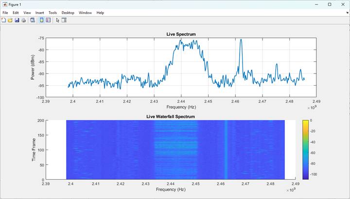
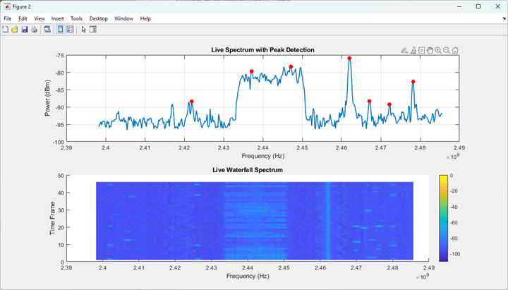
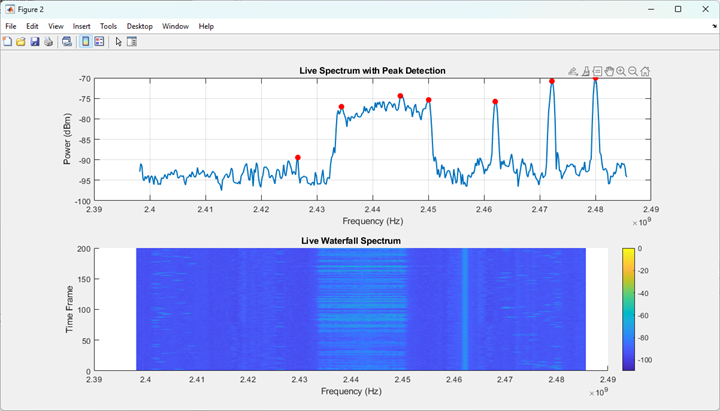

# Drone-Signal-Interference-Detection

## Requirements
- **Aaronia RSTA-Suite PRO** (latest version)
- MATLAB with:
  - Signal Processing Toolbox (for `findpeaks`)
  - HTTP Interface

## Aaronia RSTA-Suite PRO with MATLAB
This module streams spectral data from Aaronia RSTA-Suite PRO to MATLAB via an HTTP server.

### Part 1: Data Transfer Setup
1. Launch **Aaronia RSTA-Suite PRO**.
2. Navigate to `File > Open Mission`.
3. Select and open [Aaronia_to_MATLAB.rmix](./aaronia_files/Aaronia_to_MATLAB.rmix).
   - This mission file enables reading recorded data, displaying waterfall & spectrum graphs, and transmitting the data via HTTP Server.
4. Open MATLAB.
5. Load and run [Aaronia_to_MATLAB.m](./matlab_codes/Aaronia_to_MATLAB.m) to fetch and display data in MATLAB.

Example Output:



### Part 2: Peak Detection
1. Launch Aaronia software and load the mission as in Part 1.
2. Open MATLAB and load [Peak_Detection.m](./matlab_codes/Peak_Detection.m).

Example Output:



### Part 3: Channel Detection
1. Launch Aaronia software and load the mission as in Part 1.
2. Open MATLAB and load [Channel_Detection.m](./matlab_codes/Channel_Detection.m).

Example Output:



#### Example Output
```matlab
>> Channel_Detection
Detected Channels:
OFDM channel approx 16.97 MHz detected at 2.443 GHz
Narrowband signal detected: 1.16 MHz at 2.462 GHz
```